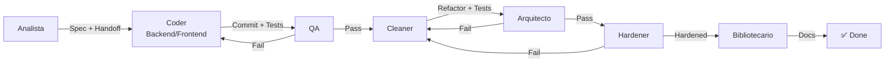

# Workflow de Orquestación (Swarm-Forge Adaptado)

Pipeline 7-agentes: Analista → Coder → QA → Cleaner → Arquitecto → Hardener → Bibliotecario.

---

## Ciclo de Vida



---

## Roles y Handoffs Explícitos

| Rol | Agente | Entrada | Salida (Handoff) |
|-----|--------|---------|------------------|
| **Analista** | `@analista` | Idea usuario | Spec funcional + `task:` name + `priority` |
| **Coder** | `@backend` + `@frontend` | Spec + RESUMEN_TAREA | Commit (10 chars), tests, `active/ANALISIS_*.md` |
| **QA** | `@qa` | Commit + Tests | PASS → Cleaner | FAIL → Coder (commit, hash, líneas) |
| **Cleaner** | `@cleaner` | Código + Tests | Refactor commits, PHPStan/Infection clean |
| **Arquitecto** | `@arquitecto` | Código post-Cleaner | APROBADO → Hardener | RECHAZADO → Cleaner (archivo:línea) |
| **Hardener** | `@hardener` | Código post-Arquitecto | 100% mutation killed, PHPStan L8, CRAP<10 |
| **Bibliotecario** | `@bibliotecario` | Código endurecido | Docs actualizadas, RESUMEN_TAREA eliminado |

---

## Protocolo de Handoff (Obligatorio)

Todo handoff **DEBE** incluir:

```markdown
type: git_handoff
to: <siguiente_rol>
priority: 10-90
task: <nombre_estable_corto>
commit: <10_hex_chars>
```

Ejemplo:
```markdown
type: git_handoff
to: qa
priority: 50
task: evolucion-pokemon
commit: a1b2c3d4e5
```

**Reglas:**
- `task:` nombre estable, corto, sin espacios (kebab-case).
- `commit:` exactamente 10 chars hex, resuelve a 1 commit.
- `priority:` 10 (bajo) a 90 (crítico).
- QA valida handoff ANTES de ejecutar tests.

---

## Fases Detalladas

### Fase 1: Analista (`@analista`)

**Inicio:** Usuario describe idea/problema.

**Hace:**
1. Analiza petición.
2. Lee contextos: `docs/context.md`, `docs/architecture.md`, `docs/conventions.md`, `src/<modulo>/context.md`.
3. Detecta: requisitos implícitos, ambigüedades, riesgos, edge cases, mejoras.
4. Genera especificación: Objetivo, Alcance, Requisitos, Edge Cases, Riesgos, Mejoras, Módulos Afectados.

**Entrega:** Handoff a Coder con `task:`, `priority:`, spec completa.

**Restricción:** Cero código.

---

### Fase 2: Coder (`@backend` + `@frontend` en paralelo)

**Inicio:** Recibe spec + handoff del Analista.

**OBLIGATORIO - Análisis Previo (antes de codear):**
- Backend: `active/ANALISIS_BACKEND.md` — archivos, tests, DTOs, enums, interfaces, riesgos.
- Frontend: `active/ANALISIS_FRONTEND.md` — vistas, componentes, DTOs Wireable, tests Dusk, estados UI, riesgos.

**Hace:**
1. TDD: test rojo → verde → refactor.
2. Tests: Unit (Domain), Feature (Use Cases), Acceptance (E2E/Dusk).
3. DTOs readonly en fronteras, Enums/Value Objects para primitivas.
4. Ejecuta: `php artisan test --compact` + `vendor/bin/phpstan analyse` + `vendor/bin/infection --min-msi=80`.

**Entrega:** Handoff a QA con `commit:` (10 chars), tests verdes, análisis previo escrito.

**Restricción:** No codear sin análisis previo escrito. TDD obligatorio.

---

### Fase 3: QA (`@qa`)

**Inicio:** Recibe commit + tests del Coder.

**Hace:**
1. Valida handoff: commit 10 chars, task name, priority.
2. Ejecuta suite completa: `php artisan test --compact`.
3. Verifica edge cases del Analista/Arquitecto.
4. Verifica coverage ≥ 80% (mutation score ≥ 80%).
5. Si FAIL: nota a Coder con commit hash, archivo:línea, test fallado.
6. Si PASS: handoff a Cleaner.

**Entrega:** PASS/FAIL + reporte + handoff.

**Restricción:** Solo valida. No toca código. Bloquea sin piedad.

---

### Fase 4: Cleaner (`@cleaner`)

**Inicio:** Código validado por QA.

**Hace:**
1. PHPStan level 6+.
2. Infection (mutation testing) — detecta mutantes supervivientes.
3. Code smells: god classes, feature envy, data clumps, shotgun surgery, primitive obsession.
4. DRY: elimina duplicación >5 líneas.
5. CRAP score < 10 por método.
6. Encapsulamiento: private/readonly, getters, colecciones tipadas.
6. Refactor en commits atómicos ("refactor: ...").
7. Verifica tests siguen verdes.

**Entrega:** Handoff a Arquitecto con commit hash.

**Restricción:** Cero cambio de comportamiento. Cero features. Commits atómicos revertibles.

---

### Fase 5: Arquitecto (`@arquitecto`)

**Inicio:** Código post-Cleaner.

**Hace (Code Review Arquitectónico):**
1. Dependency direction: `src/` no importa `App\`/`Illuminate\` (salvo `Infra/`).
2. Boundaries: Domain ↔ Infra por interfaces.
3. Enums/Value Objects para primitivas cerradas.
4. DTOs readonly en fronteras (3+ params).
5. Propiedades private/readonly, getters tipados, colecciones tipadas.
6. Property tests en Domain (invariantes).
7. Sin god classes (>200 líneas / >5 responsabilidades).
8. Sin dependencias circulares.
9. Violaciones conocidas resueltas (TeamSrv, ReclutamientoSrv, BattleSrv, etc.).

**Entrega:** APROBADO → Hardener | RECHAZADO → Cleaner (archivo:línea, regla, fix sugerido).

**Restricción:** No codea. Feedback accionable: archivo, línea, regla, fix.

---

### Fase 6: Hardener (`@hardener`)

**Inicio:** Código aprobado por Arquitecto.

**Hace:**
1. Infection: **100% mutation score** (todos mutantes muertos).
2. PHPStan **level 8+** (strict).
3. CRAP score < 10 en TODOS los métodos.
4. DRY: 0 duplicación >5 líneas.
5. Language mutation: `declare(strict_types=1)`, types completos, readonly, enums.
6. Soft Gherkin mutation: mutar specs → tests deben fallar.

**Entrega:** PASS → Bibliotecario | FAIL → Cleaner/Coder (commit, hash, métrica fallada).

**Restricción:** No cambia comportamiento. Bloquea si métricas no cumplen. Última barrera.

---

### Fase 7: Bibliotecario (`@bibliotecario`)

**Inicio:** Código endurecido, tests verdes, métricas OK.

**Hace:**
1. Lee `active/RESUMEN_TAREA.md`.
2. Actualiza docs permanentes:
   - `docs/context.md` — resumen funcional, módulos, referencias.
   - `docs/architecture.md` — patrones, componentes, decisiones.
   - `src/<modulo>/context.md` — funcionalidades, cambios, dependencias, decisiones, motivos.
3. Limpia: elimina duplicados, obsoletos, irrelevantes.
4. **Elimina** `active/RESUMEN_TAREA.md` y `active/ANALISIS_*.md`.

**Verificación final:**
- [ ] `docs/context.md` actualizado
- [ ] `docs/architecture.md` actualizado si aplica
- [ ] `src/<modulo>/context.md` actualizado
- [ ] Sin contradicciones entre docs
- [ ] Sin conocimiento solo en `active/`
- [ ] `active/RESUMEN_TAREA.md` eliminado seguro

**Entrega:** Tarea cerrada. Ciclo reinicia en Analista.

---

## Métricas de Calidad (No Negociables)

| Métrica | Objetivo | Fase |
|---------|----------|------|
| Test Coverage | ≥ 80% | Coder |
| Mutation Score (MSI) | ≥ 80% | Coder → 100% Hardener |
| PHPStan Level | 6+ (Coder) → 8 (Hardener) | Coder → Hardener |
| CRAP Score | < 10/método | Cleaner → Hardener |
| DRY | 0 duplicación >5 líneas | Cleaner → Hardener |
| Handoff Validity | 100% | QA |

---

## Flujo Rápido (Ejemplo)

```
Usuario: "Sistema de evolución Pokémon"
  → @analista (spec + handoff task:evolucion-pokemon priority:50)
    → @backend + @frontend (ANALISIS_*.md → TDD → commit a1b2c3d4e5)
      → @qa (tests + edge cases → PASS handoff task:evolucion-pokemon commit:a1b2c3d4e5)
        → @cleaner (refactor → PHPStan L6 + Infection 80% → commit f6g7h8i9j0)
          → @arquitecto (review → APROBADO handoff commit:f6g7h8i9j0)
            → @hardener (100% mutation + PHPStan L8 + CRAP<10 → commit k1l2m3n4o5)
              → @bibliotecario (docs → elimina active/ → ✅ Done)
```

---

## Notas

- `active/RESUMEN_TAREA.md` y `active/ANALISIS_*.md` son **temporales**. Ciclo: Analista→Coder→Cleaner→Arquitecto→Hardener→Bibliotecario (elimina).
- Contextos módulo (`src/<modulo>/context.md`) se crean bajo demanda.
- Tareas triviales (typo, config): saltar fases a criterio, pero **QA + Hardener siempre**.
- Si cualquier fase FAIL: vuelta atrás con commit hash y ubicación exacta. No "arreglar sobre la marcha".