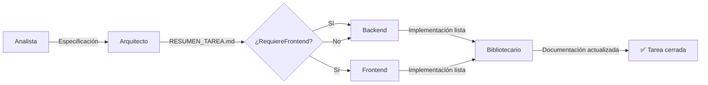

# Workflow de orquestación

Pipeline de extremo a extremo para el desarrollo de funcionalidades en el proyecto Pokemon.

---

## Ciclo de vida de una tarea



---

## Roles

| Rol | Agente | Responsabilidad |
|---|---|---|
| **Analista** | `@analista` (default) | Transforma ideas en especificaciones claras. No escribe código. |
| **Arquitecto** | `@arquitecto` | Diseña la solución técnica y genera `active/RESUMEN_TAREA.md`. No escribe código. |
| **Backend** | `@backend` | Implementa la lógica de backend (Laravel) según el diseño del Arquitecto. |
| **Frontend** | `@frontend` | Implementa la interfaz de usuario (Blade) según el diseño del Arquitecto. |
| **Bibliotecario** | `@bibliotecario` | Documenta el conocimiento generado y cierra la tarea. |

---

## Fases

### Fase 1: Analista

**Inicio**: El usuario describe una idea, necesidad o problema.

**Qué hace**:
1. Analiza la petición del usuario.
2. Revisa `docs/context.md`, `docs/architecture.md`, `docs/conventions.md` y los contextos de módulos afectados (`src/<modulo>/context.md`).
3. Identifica requisitos implícitos, ambigüedades, riesgos y casos límite.
4. Propone mejoras si aplica.
5. Genera una especificación funcional con:
   - Objetivo
   - Alcance
   - Requisitos funcionales y no funcionales
   - Casos límite
   - Riesgos
   - Mejoras propuestas
   - Módulos afectados

**Transición**: Entrega el análisis al Arquitecto (`@arquitecto`) con la instrucción de diseñar la solución.

**Restricción**: No generar código.

---

### Fase 2: Arquitecto

**Inicio**: Recibe la especificación del Analista.

**Qué hace**:
1. Revisa la propuesta del Analista.
2. Consulta `docs/context.md`, `docs/architecture.md`, `docs/conventions.md`.
3. Diseña la solución técnica.
4. Define responsabilidades de cada módulo.
5. Valida el impacto arquitectónico.
6. Aprueba o rechaza cambios estructurales.
7. Genera `active/RESUMEN_TAREA.md` con la siguiente estructura:

```markdown
# Objetivo

# Alcance

# Módulos afectados

# Diseño técnico

# Cambios Backend

# Cambios Frontend

# Casos límite

# Riesgos

# Checklist de implementación

# Checklist de validación
```

**Transición**:
- Si requiere cambios de backend y frontend → invocar `@backend` y `@frontend`.
- Si solo requiere backend → invocar `@backend`.
- Si solo requiere frontend → invocar `@frontend`.

**Restricción**: No implementar código. No modificar documentación histórica.

---

### Fase 3a: Backend

**Inicio**: Recibe `active/RESUMEN_TAREA.md` generado por el Arquitecto.

**Qué hace**:
1. Lee `active/RESUMEN_TAREA.md`.
2. Consulta `docs/context.md`, `docs/architecture.md`, `docs/conventions.md` y `src/<modulo>/context.md`.
3. Implementa los cambios definidos en la sección "Cambios Backend".
4. Sigue las buenas prácticas del proyecto (SOLID, controladores ligeros, Services, Form Requests, etc.).
5. Añade tests cuando corresponda.

**Puede modificar**:
- Controllers, Services, Models, Policies, Events, Jobs, Commands, Requests, Migrations, Tests.

**Antes de finalizar** verificar:
- Checklist de implementación.
- Checklist de validación.
- Compatibilidad con módulos afectados.
- Ausencia de código muerto.

**Restricciones**:
- No modificar arquitectura sin aprobación del Arquitecto.
- No modificar documentación de contexto.

**Transición**: Cuando la implementación esté lista, invocar al Bibliotecario (`@bibliotecario`) para documentar y cerrar la tarea. Si también participó Frontend, coordinar con ese agente antes de pasar al Bibliotecario.

---

### Fase 3b: Frontend

**Inicio**: Recibe `active/RESUMEN_TAREA.md` generado por el Arquitecto.

**Qué hace**:
1. Lee `active/RESUMEN_TAREA.md`.
2. Consulta `docs/context.md`, `docs/architecture.md`, `docs/conventions.md` y `src/<modulo>/context.md`.
3. Implementa los cambios definidos en la sección "Cambios Frontend".
4. Sigue las buenas prácticas (vistas limpias, componentes reutilizables, accesibilidad, etc.).

**Puede modificar**:
- Blade Views, Blade Components, JavaScript, CSS, Assets Frontend.

**Antes de finalizar** verificar:
- Checklist de implementación.
- Checklist de validación.
- Correcta visualización en todos los estados.
- Casos límite definidos por el Arquitecto.
- Compatibilidad con componentes existentes.
- Ausencia de código duplicado.

**Restricciones**:
- No modificar arquitectura sin aprobación del Arquitecto.
- No modificar documentación de contexto.
- No introducir nuevas convenciones visuales sin justificación.

**Transición**: Cuando la implementación esté lista, invocar al Bibliotecario (`@bibliotecario`). Si también participó Backend, coordinar con ese agente antes de pasar al Bibliotecario.

---

### Fase 4: Bibliotecario

**Inicio**: Backend y/o Frontend han completado la implementación.

**Qué hace**:
1. Lee `active/RESUMEN_TAREA.md`.
2. Consulta `docs/context.md`, `docs/architecture.md`, `docs/conventions.md` y `src/<modulo>/context.md`.
3. Identifica el conocimiento relevante generado durante la tarea.
4. Actualiza la documentación permanente:
   - `docs/context.md` — añade resumen funcional del cambio, módulos afectados, referencias relevantes.
   - `docs/architecture.md` — si hay nuevos patrones, componentes, integraciones o cambios estructurales.
   - `src/<modulo>/context.md` — registra funcionalidades añadidas, cambios relevantes, dependencias, casos especiales, restricciones, decisiones y motivos.
5. Mantiene limpieza documental: elimina información duplicada, obsoleta o irrelevante.
6. **Elimina** `active/RESUMEN_TAREA.md` (el conocimiento ya fue absorbido por la documentación permanente).

**Verificación final**:
- `docs/context.md` actualizado.
- `docs/architecture.md` actualizado si aplica.
- `src/<modulo>/context.md` actualizado.
- No existen contradicciones entre documentos.
- No queda conocimiento relevante únicamente en `active/`.
- `active/RESUMEN_TAREA.md` puede eliminarse de forma segura.

**Resultado esperado**: Cualquier agente debe ser capaz de comprender qué existe, cómo funciona, por qué se diseñó así y qué restricciones tiene, sin necesidad de revisar el historial completo del proyecto.

**Transición**: Tarea finalizada. El ciclo puede comenzar de nuevo con una nueva solicitud al Analista.

---

## Flujo rápido (ejemplo)

```
Usuario: "Necesito añadir un sistema de evolución de Pokemon"
  → @analista  (analiza, genera especificación)
    → @arquitecto  (diseña solución, genera active/RESUMEN_TAREA.md)
      → @backend  (implementa migraciones, modelos, lógica de evolución)
      → @frontend  (implementa vista de evolución)
        → @bibliotecario  (documenta cambios, cierra tarea)
```

---

## Notas importantes

- `active/RESUMEN_TAREA.md` es un **documento temporal**. Su ciclo de vida comienza en la Fase 2 (Arquitecto) y termina en la Fase 4 (Bibliotecario), donde se elimina.
- Los contextos de módulo (`src/<modulo>/context.md`) se crean bajo demanda cuando un módulo adquiere suficiente entidad.
- Si una tarea es muy pequeña (ej: corregir un typo), el flujo puede simplificarse saltando fases a criterio del equipo.
