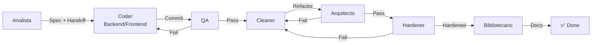

# Workflow de Orquestación (Swarm-Forge Adaptado)

Pipeline 7-agentes: Analista → Coder → QA → Cleaner → Arquitecto → Hardener → Bibliotecario. El testing está diferido al cierre del módulo completo: no se ejecuta durante el desarrollo normal.

---

## Ciclo de Vida



---

## Roles y Handoffs Explícitos

| Rol | Agente | Entrada | Salida (Handoff) |
|-----|--------|---------|------------------|
| **Analista** | `@analista` | Idea usuario | Spec funcional + `task:` name + `priority` + comportamientos a testear (testing diferido) |
| **Coder** | `@backend` + `@frontend` | Spec + RESUMEN_TAREA | Commit (10 chars), `active/ANALISIS_*.md` (sin ejecutar tests) |
| **QA** | `@qa` | Commit | PASS → Cleaner | FAIL → Coder (commit, hash, líneas) |
| **Cleaner** | `@cleaner` | Código | Refactor commits, PHPStan clean (sin testing) |
| **Arquitecto** | `@arquitecto` | Código post-Cleaner | APROBADO → Hardener | RECHAZADO → Cleaner (archivo:línea) |
| **Hardener** | `@hardener` | Código post-Arquitecto | PHPStan L8, CRAP<10, tipado/DRY (sin testing) |
| **Bibliotecario** | `@bibliotecario` | Código endurecido | Docs actualizadas, RESUMEN_TAREA eliminado |

---

## Protocolo de Handoff (Obligatorio)

Todo handoff **DEBE** incluir:

```markdown
type: git_handoff
to: <siguiente_rol>
priority: 10-90
task: <nombre_estable_corto>
commit: <10_hex_chars>
```

Ejemplo:
```markdown
type: git_handoff
to: qa
priority: 50
task: evolucion-pokemon
commit: a1b2c3d4e5
```

**Reglas:**
- `task:` nombre estable, corto, sin espacios (kebab-case).
- `commit:` exactamente 10 chars hex, resuelve a 1 commit.
- `priority:` 10 (bajo) a 90 (crítico).
- QA valida handoff ANTES de la revisión estática.

---

## Fases Detalladas

### Fase 1: Analista (`@analista`)

**Inicio:** Usuario describe idea/problema.

**Hace:**
1. Analiza petición.
2. Lee contextos: `docs/context.md`, `docs/architecture.md`, `docs/conventions.md`, `src/<modulo>/context.md`.
3. Detecta: requisitos implícitos, ambigüedades, riesgos, edge cases, mejoras.
4. Genera especificación: Objetivo, Alcance, Requisitos, Edge Cases, Riesgos, Mejoras, Módulos Afectados, Comportamientos a cubrir en el testing futuro.
5. Al terminar todo el flujo, preguntar al usuario si desea testing específico para la implementación.

**Entrega:** Handoff a Coder con `task:`, `priority:`, spec completa.

**Restricción:** Cero código. No ejecuta testing (testing diferido).

---

### Fase 2: Coder (`@backend` + `@frontend` en paralelo)

**Inicio:** Recibe spec + handoff del Analista.

**OBLIGATORIO - Análisis Previo (antes de codear):**
- Backend: `active/ANALISIS_BACKEND.md` — archivos, DTOs, enums, interfaces, comportamientos a cubrir en el testing futuro, riesgos.
- Frontend: `active/ANALISIS_FRONTEND.md` — vistas, componentes, DTOs consumidos, comportamientos a cubrir en el testing futuro, estados UI, riesgos.

**Hace:**
1. Implementa código tipado (sin arrays; DTOs/Collections).
2. DRY por módulo y `src/Shared`.
3. DTOs readonly en fronteras, Enums/Value Objects para primitivas.
4. Escribe análisis previo con los comportamientos a cubrir en el testing futuro.
5. Aplica formato: `vendor/bin/pint --dirty --format agent`.

**Entrega:** Handoff a QA con `commit:` (10 chars), análisis previo escrito con comportamientos a testear.

**Restricción:** No codear sin análisis previo. Testing diferido. No ejecutar tests.

---

### Fase 3: QA (`@qa`)

**Inicio:** Recibe commit del Coder.

**Hace:**
1. Valida handoff: commit 10 chars, task name, priority.
2. Revisión estática: edge cases por lectura, tipado, DTOs, Collections, DRY y handoff.
3. Verifica edge cases del Analista/Arquitecto (por lectura, sin ejecutar tests).
4. Si FAIL: nota a Coder con commit hash, archivo:línea.
5. Si PASS: handoff a Cleaner.

**Entrega:** PASS/FAIL + reporte de revisión estática + handoff.

**Restricción:** Solo valida. No toca código. No ejecutar testing (diferido). Bloquea sin piedad.

---

### Fase 4: Cleaner (`@cleaner`)

**Inicio:** Código validado por QA.

**Hace:**
1. PHPStan level 6+ (análisis estático).
2. Code smells: god classes, feature envy, data clumps, shotgun surgery, primitive obsession.
3. DRY: elimina duplicación >5 líneas.
4. CRAP score < 10 por método.
5. Encapsulamiento: private/readonly, getters, colecciones tipadas.
6. Refactor en commits atómicos ("refactor: ...").
7. Verifica por lectura/diff que el comportamiento no cambia (sin ejecutar tests).

**Entrega:** Handoff a Arquitecto con commit hash.

**Restricción:** Cero cambio de comportamiento. Cero features. No ejecuta testing (diferido). Commits atómicos revertibles.

---

### Fase 5: Arquitecto (`@arquitecto`)

**Inicio:** Código post-Cleaner.

**Hace (Code Review Arquitectónico):**
1. Dependency direction: `src/` no importa `App\`/`Illuminate\` (salvo `Infra/`).
2. Boundaries: Domain ↔ Infra por interfaces.
3. Enums/Value Objects para primitivas cerradas.
4. DTOs readonly en fronteras (3+ params).
5. Propiedades private/readonly, getters tipados, colecciones tipadas.
6. Tipado y DRY: sin arrays públicos, DTOs/Collections tipadas, sin duplicación >5 líneas.
7. Sin god classes (>200 líneas / >5 responsabilidades).
8. Sin dependencias circulares.
9. Violaciones conocidas resueltas (TeamSrv, ReclutamientoSrv, BattleSrv, etc.).

**Entrega:** APROBADO → Hardener | RECHAZADO → Cleaner (archivo:línea, regla, fix sugerido).

**Restricción:** No codea. No ejecuta testing (diferido al cierre del módulo). Feedback accionable: archivo, línea, regla, fix.

---

### Fase 6: Hardener (`@hardener`)

**Inicio:** Código aprobado por Arquitecto.

**Hace:**
1. PHPStan **level 8+** (strict).
2. CRAP score < 10 en TODOS los métodos.
3. DRY: 0 duplicación >5 líneas.
4. Language mutation: `declare(strict_types=1)`, types completos, readonly, enums.
5. Sin arrays públicos: DTOs, DTOCollection y Collections tipadas.

**Entrega:** PASS → Bibliotecario | FAIL → Cleaner/Coder (commit, hash, métrica de código fallada).

**Restricción:** No cambia comportamiento. No ejecuta testing (diferido). Bloquea si las métricas de código no cumplen. Última barrera.

---

### Fase 7: Bibliotecario (`@bibliotecario`)

**Inicio:** Código endurecido, métricas de código OK (testing diferido al cierre del módulo).

**Hace:**
1. Lee `active/RESUMEN_TAREA.md`.
2. Actualiza docs permanentes:
   - `docs/context.md` — resumen funcional, módulos, referencias.
   - `docs/architecture.md` — patrones, componentes, decisiones.
   - `src/<modulo>/context.md` — funcionalidades, cambios, dependencias, decisiones, motivos.
3. Limpia: elimina duplicados, obsoletos, irrelevantes.
4. **Elimina** `active/RESUMEN_TAREA.md` y `active/ANALISIS_*.md`.

**Verificación final:**
- [ ] `docs/context.md` actualizado
- [ ] `docs/architecture.md` actualizado si aplica
- [ ] `src/<modulo>/context.md` actualizado
- [ ] Sin contradicciones entre docs
- [ ] Sin conocimiento solo en `active/`
- [ ] `active/RESUMEN_TAREA.md` eliminado seguro

**Entrega:** Tarea cerrada. Ciclo reinicia en Analista.

---

## Métricas de Calidad (No Negociables)

El testing (coverage y mutation score) NO forma parte del flujo normal: se difiere al cierre del módulo completo.

| Métrica | Objetivo | Fase |
|---------|----------|------|
| PHPStan Level | 6+ (Coder) → 8 (Hardener) | Coder → Hardener |
| CRAP Score | < 10/método | Cleaner → Hardener |
| DRY | 0 duplicación >5 líneas | Cleaner → Hardener |
| Sin arrays públicos | 100% (DTOs/Collections) | Coder → Hardener |
| Handoff Validity | 100% | QA |
| Test Coverage / Mutation Score | Diferido al cierre del módulo | Fase de testing posterior |

---

## Flujo Rápido (Ejemplo)

```
Usuario: "Sistema de evolución Pokémon"
  → @analista (spec + handoff task:evolucion-pokemon priority:50)
    → @backend + @frontend (ANALISIS_*.md con comportamientos a testear → commit a1b2c3d4e5)
      → @qa (revisión estática + edge cases → PASS handoff task:evolucion-pokemon commit:a1b2c3d4e5)
        → @cleaner (refactor → PHPStan L6 + DRY → commit f6g7h8i9j0)
          → @arquitecto (review → APROBADO handoff commit:f6g7h8i9j0)
            → @hardener (PHPStan L8 + CRAP<10 + sin arrays → commit k1l2m3n4o5)
              → @bibliotecario (docs → elimina active/ → ✅ Done)
                → @analista (testing diferido: pregunta al usuario si desea testing específico)
```

---

## Notas

- `active/RESUMEN_TAREA.md` y `active/ANALISIS_*.md` son **temporales**. Ciclo: Analista→Coder→Cleaner→Arquitecto→Hardener→Bibliotecario (elimina).
- Contextos módulo (`src/<modulo>/context.md`) se crean bajo demanda.
- Tareas triviales (typo, config): saltar fases a criterio, pero **QA + Hardener siempre**.
- Si cualquier fase FAIL: vuelta atrás con commit hash y ubicación exacta. No "arreglar sobre la marcha".
- El testing se ejecuta en una fase posterior sobre el módulo completo, nunca durante el desarrollo normal.
- Al cierre del flujo, el Analista pregunta al usuario si desea testing específico para la implementación.